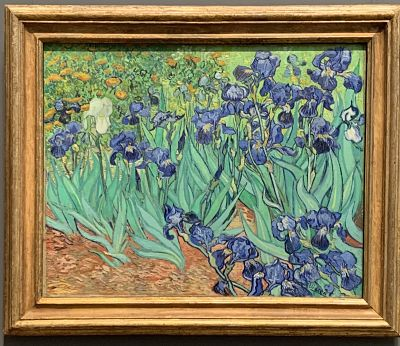

# Assignment 1
<http://github.com/zxzheng23>

## My Goals for HUDK4050
* Be more familar with RStudio
* Learn how to do data mining for educational data
* Be an expert of visualization

## Video Review
When I watch 1.4 Git & Github, I finally know and understand how this git things work. The walking through video is helpful. The video has detailed information which I hope to keep, and I hope the class pace can be fasten. 

|Skill|Score|
|:---:|:---:|
|web scraping and text mining|4|
|I like the information these videos are providing and how detailed they are.|
|Can you show us more R skills?|

## This is how I am feeling about the semester

  