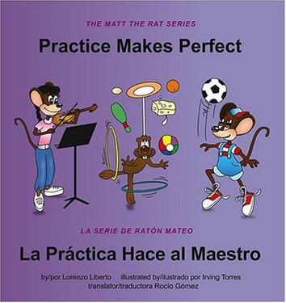

# Assignment 1
<https://github.com/Xingyixie>

## My Goals for HUDK4050

- First goal: learn how to conduct data mining
- Second goal: learn R and R Studio (and Markdown grammar) and link R with Github
- Third goal: understand social network analysis and PCA and Clustering analysis.

## Video Review
<!--Text comment--> I have learnt a lot from class videos, and I think only when we try to do data analysis can we feel this, and thus we can analyze them appropriately.

My table:

 Skill | Score |
|------:|:-----|
| Language | 8 |
| Videos | Perfect |

 

## This is how I am feeling about the semester