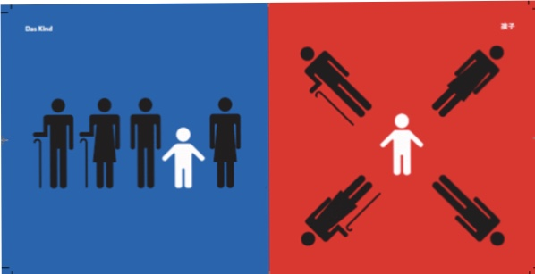

# Assignment 1

https://github.com/Zjh980709

## My Goals for HUDK4050

1. learn R language
2. write and run the code by myself
3. Try to finsih a project with R 

## Video Review

After watching the video, I start to know R and Git. Through the video, I learned how to download and use R studio, and how to pull request to submit the assignment. Because this is my first time to learn about R, I don't think that I have something to change. However, I will keep the learning mode to learn more information in the rest of this semester.

| Skill | Score |
| --- | --- |
| Comprehension | All the videos are clear enough |
| 5 | I think that you can add more detailed codes or operations |

## This is how I am feeling about the semester

