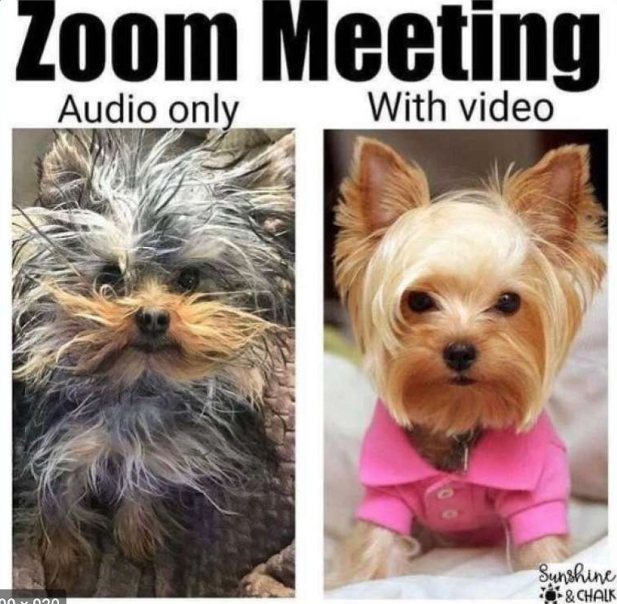

# [Assignment 1](https://github.com/RichardPan01/assignment1)
[My Github](https://github.com/RichardPan01)

## My Goals for HUDK4050
* Improve my data mining skill
* Related the skill to real world
* Do some projects to prepare for future job

## Video Review

The Video Transcript is good when reviewing the video, I would keep it.However, I would like to add more explaination text on the screen.

Skill|Score|
:----:|:----:|
Modeling|I like the form to submit the homework, because it makes me feel like doing 'real world' project|
3|I would like to learn more about how a real data scientist work|

## This is how I am feeling about the semester

> JUST FOR FUN

```{r, out.width='50%', fig.align='center', fig.cap='HaHa', echo=FALSE}

```


